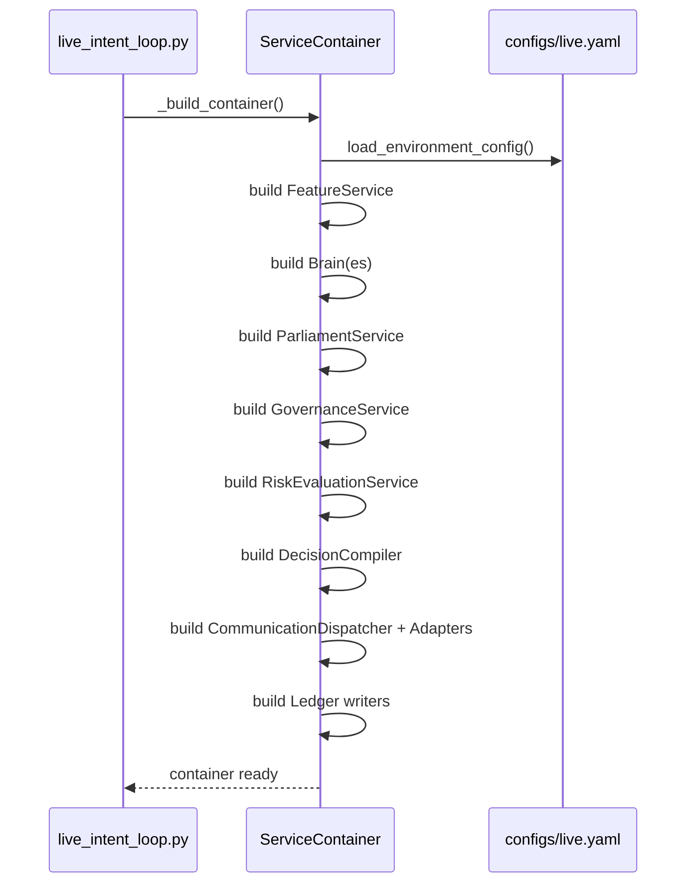
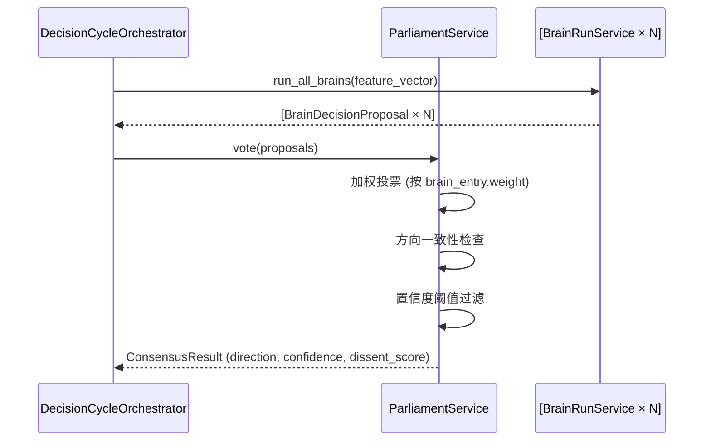
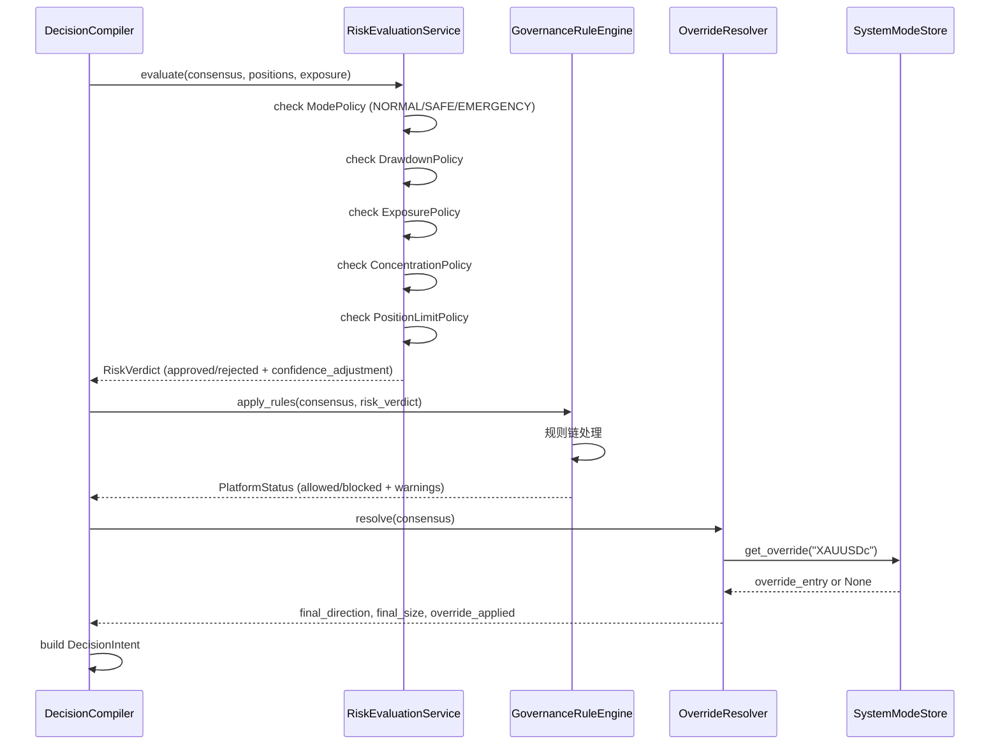
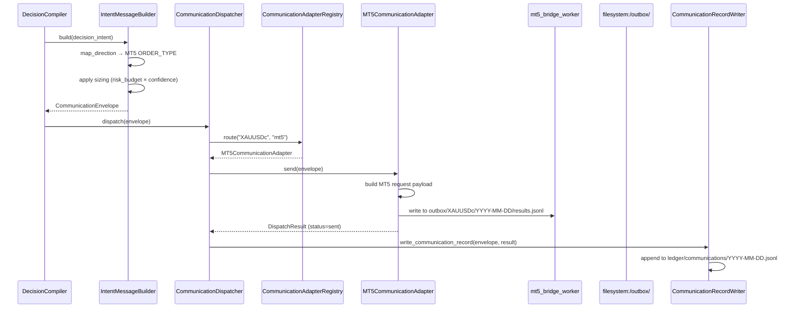
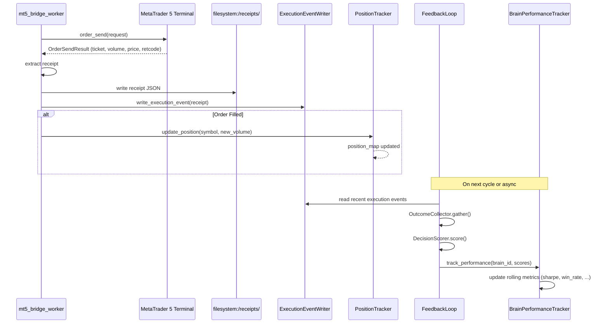

# DATA FLOW — 数据流全景

> **最后更新**: 2026-05-02T07:05:00Z  
> **描述**: 一笔决策从特征提取到实盘执行的完整数据旅程

---

## 总览

```
┌─ 数据入口 ────→ 特征层 ────→ 模型推理 ────→ 议会投票 ────→ 决策编译 ────→ 通信派发 ────→ 执行 & 反馈 ─┐
│                                                                                                      │
└────────────────────────────────── 账本贯穿全程 (写入 & 对账) ──────────────────────────────────────────┘
```

---

## 阶段 1: 系统启动与装配



---

## 阶段 2: 特征提取 (Feature → Vector)

```mermaid
sequenceDiagram
    participant Loop as live_intent_loop
    participant FS as FeatureService
    participant Store as LocalFeatureStore (JSONL)
    participant Comp as V9LiveFeatureComputer
    participant MT5 as MT5 Bridge

    Loop->>FS: get_features(symbol="XAUUSDc", schema="V9_INSTITUTIONAL_40")
    FS->>Store: Tier1: get_latest(symbol, schema)
    alt Cache Hit (24h valid)
        Store-->>FS: FeatureRecord (cached)
    else Cache Miss / Expired
        FS->>Comp: Tier2: compute(symbol)
        Comp->>MT5: get_candles() / get_ticks()
        MT5-->>Comp: OHLCV + Tick data
        Comp->>Comp: compute_40_features()
        Comp-->>FS: np.ndarray (40,)
        FS->>Store: upsert_record(FeatureRecord)
    end
    FS->>FS: normalize(feature_vector)
    FS-->>Loop: np.ndarray (40,) float32
```

**数据产物**: `feature_vector: np.ndarray[float32] shape=(40,)`  
**存储位置**: `data/feature_store/{symbol}/{schema}/features.jsonl`

---

## 阶段 3: 模型推理 (Vector → BrainDecisionProposal)

```mermaid
sequenceDiagram
    participant Loop as live_intent_loop
    participant Brain as BrainRunService
    participant Adapter as V9OnnxBrainAdapter
    participant ONNX as ONNX Runtime

    Loop->>Brain: run_brain(brain_id, feature_vector)
    Brain->>Adapter: infer(feature_vector)
    Adapter->>Adapter: reshape(1, 40) → float32
    Adapter->>ONNX: session.run([out_dir, out_risk, out_vol])
    ONNX-->>Adapter: [logits(1,3), risk(1,1), vol(1,1)]
    Adapter->>Adapter: _decode_direction(logits) → (idx, confidence)
    Adapter->>Adapter: _map_direction(idx) → "long"/"short"/"neutral"
    Adapter->>Adapter: _map_probabilities(direction, confidence) → (up, down)
    Adapter-->>Brain: dict{out_dir, out_risk, out_vol, runtime_ms, fallback}
    Brain->>Brain: get_signal(raw_output) → BrainDecisionProposal
    Brain-->>Loop: BrainDecisionProposal
```

**数据产物**: `BrainDecisionProposal` (prediction + applicability + rationale + health)

---

## 阶段 4: 议会投票 (Proposals → Consensus)



**数据产物**: `ConsensusResult`

---

## 阶段 5: 风控 + 治理 + 覆盖 (Safety Gates)



**数据产物**: `DecisionIntent` (validated, gated, potentially overridden)

---

## 阶段 6: 通信派发 (Intent → Order)



**数据产物**: `CommunicationRecord` (persisted in JSONL ledger)  
**文件路径**: `outbox/{symbol}/{date}/results.jsonl` (MT5 指令) | `ledger/communications/{date}.jsonl` (审计记录)

---

## 阶段 7: 执行与反馈 (Execution → Feedback)



**数据产物**: `ExecutionEvent` (persisted in JSONL ledger) | PositionMap 更新 | PerformanceMetric 滚动更新

---

## 完整数据流符号图

```mermaid
flowchart LR
    subgraph INPUT["Data Inputs"]
        MT5_TICK["MT5 Tick/Candle"]
        CONFIG["configs/live.yaml"]
    end

    subgraph FEATURES["Feature Pipeline"]
        TIER1["Tier1: Cache Read"]
        TIER2["Tier2: Live Compute"]
        NORM["Normalize"]
    end

    subgraph BRAIN["Brain Inference"]
        ONNX["ONNX Runtime"]
        LOGITS["Logits → Direction"]
    end

    subgraph DECISION["Decision Pipeline"]
        PARLIAMENT["Vote"]
        RISK["Risk Gate"]
        GOVERNANCE["Governance"]
        OVERRIDE["Override"]
        COMPILE["Compile Intent"]
    end

    subgraph DISPATCH["Dispatch Pipeline"]
        BUILD["Build Envelope"]
        ROUTE["Route Adapter"]
        SEND["Send Order"]
    end

    subgraph EXECUTION["Execution & Feedback"]
        MT5_EXEC["MT5 Execute"]
        RECEIPT["Receipt"]
        LEDGER["Ledger Write"]
        POSITION["Position Update"]
        FEEDBACK["Feedback Loop"]
    end

    MT5_TICK --> TIER1
    TIER1 --> TIER2
    TIER2 --> NORM
    CONFIG --> FEATURES
    NORM --> ONNX
    ONNX --> LOGITS
    LOGITS --> PARLIAMENT
    PARLIAMENT --> RISK
    RISK --> GOVERNANCE
    GOVERNANCE --> OVERRIDE
    OVERRIDE --> COMPILE
    COMPILE --> BUILD
    BUILD --> ROUTE
    ROUTE --> SEND
    SEND --> MT5_EXEC
    MT5_EXEC --> RECEIPT
    RECEIPT --> LEDGER
    LEDGER --> POSITION
    POSITION --> FEEDBACK
    FEEDBACK -.->|performance update| BRAIN
    LEDGER -.->|historical data| FEATURES
```



---

## 数据持久化总览

| 数据类型 | 存储位置 | 格式 | 生命周期 |
|----------|----------|------|----------|
| Feature Records | `data/feature_store/{symbol}/{schema}/` | JSONL | 7 天滚动 |
| Brain Inference Cache | 内存 | dict | 单周期 |
| Communication Records | `ledger/communications/{date}.jsonl` | JSONL | 永久 |
| Execution Events | `ledger/executions/{date}.jsonl` | JSONL | 永久 |
| Decision Records | `ledger/decisions/{date}.jsonl` | JSONL | 永久 |
| MT5 Order Instructions | `outbox/{symbol}/{date}/results.jsonl` | JSONL | 7 天 |
| MT5 Receipts | `receipts/{symbol}/{date}/` | JSON | 30 天 |
| Performance Metrics | 内存 (计划迁移至 `ledger/performance/`) | — | 进程生命周期 |

---

## 关键延迟路径 (端到端)

```
Tick Arrival → Feature Compute → ONNX Infer → Parliament → Compile → Dispatch → MT5 Execute → Receipt

   ~50ms        ~100ms           ~5ms          ~1ms        ~1ms       ~5ms          ~20ms         ~10ms

===============================================================================================
   Total E2E Latency: ~200ms (典型值, 不含 MT5 网络延迟)
```

- Feature Compute: 40 维计算含 candle 查询
- ONNX Infer: CPU 单线程推理, V9 模型 ~5ms
- Parliament: 单模型场景下跳过投票
- Dispatch: 文件队列写入 + Bridge 轮询