# SYSTEM TOPOLOGY — 系统拓扑总图

> **最后更新**: 2026-05-02T07:05:00Z  
> **源图**: [diagrams/topology.mermaid](diagrams/topology.mermaid)

---

## 层级速览

```
┌─────────────────────────────────────────────────┐
│  scripts/       生产入口层 (Production Entry)     │
│  apps/          编排层 (Orchestration)             │
├─────────────────────────────────────────────────┤
│  ServiceContainer  DI 装配中枢                    │
├───────────────┬─────────────────────────────────┤
│  core/brains  │  core/features  特征层            │
│  模型层       │                                   │
├───────────────┼─────────────────────────────────┤
│  parliament   │  governance     治理层            │
│  议会层       │                                   │
├───────────────┴─────────────────────────────────┤
│  protocol/services   决策编译 · 通信派发          │
├───────────────┬─────────────────────────────────┤
│  risk         │  execution       执行层           │
│  风控层       │                                   │
├───────────────┼─────────────────────────────────┤
│  ledger       │  feedback         反馈层          │
│  账本层       │                                   │
├───────────────┴─────────────────────────────────┤
│  observability   可观测性                         │
│  state           状态存储                         │
│  deployment      部署与运维                       │
├─────────────────────────────────────────────────┤
│  External: MT5 Terminal / Bridge / FileSystem    │
└─────────────────────────────────────────────────┘
```

---

## 完整拓扑图 (Mermaid)

```mermaid
graph TB
    subgraph SCRIPTS["🔧 scripts/ — 生产入口"]
        LIVE["live_intent_loop.py"]
        BRIDGE["mt5_bridge_worker.py"]
        DISPATCH_POLICY["live_dispatch_policy.py"]
        HEALTHCHECK["live_auto_healthcheck.py"]
    end
    subgraph APPS["🎮 apps/ — 编排层"]
        MAIN["main.py cmd_run"]
        ORCHESTRATOR["DecisionCycleOrchestrator"]
        RUNTIME["RuntimeLoop"]
    end
    subgraph CONTAINER["🧩 ServiceContainer"]
        SC["ServiceContainer"]
    end
    subgraph FEATURES["📊 core/features"]
        FEAT_SVC["FeatureService"]
        FEAT_STORE["LocalFeatureStore"]
        FEAT_COMPUTER["V9LiveFeatureComputer"]
        FEAT_ADAPTER["V9FeatureAdapter"]
    end
    subgraph BRAINS["🧠 core/brains"]
        BRAIN_FACTORY["BrainFactory"]
        BRAIN_REGISTRY["BrainRegistryService"]
        BRAIN_RUN["BrainRunService"]
        BRAIN_ADAPTER_V9["V9OnnxBrainAdapter"]
        BRAIN_ADAPTER_XGB["XGBoostBrainAdapter"]
    end
    subgraph PARLIAMENT["🏛️ core/parliament"]
        PARLIAMENT_SVC["ParliamentService"]
    end
    subgraph GOVERNANCE["⚖️ core/governance"]
        GOV_SVC["GovernanceService"]
        GOV_RULES["GovernanceRuleEngine"]
    end
    subgraph DECISION["📋 Decision & Dispatch"]
        OVERRIDE["OverrideResolver"]
        COMPILER["DecisionCompiler"]
        INTENT_MSG["IntentMessageBuilder"]
        DISPATCHER["CommunicationDispatcher"]
        ADAPTER_REG["CommunicationAdapterRegistry"]
    end
    subgraph COMM_ADAPTERS["📡 Adapters"]
        STUB_ADAPTER["StubCommunicationAdapter"]
        FILEQ_ADAPTER["FileQueueCommunicationAdapter"]
        MT5_ADAPTER["MT5CommunicationAdapter"]
        FIX_ADAPTER["FixCommunicationAdapter"]
    end
    subgraph LEDGER["📒 core/ledger"]
        LEDGER_STORE["JsonlLedgerStore"]
        COMM_WRITER["CommunicationRecordWriter"]
        COMM_READER["CommunicationRecordReader"]
        EXEC_WRITER["ExecutionEventWriter"]
        EXEC_READER["ExecutionEventReader"]
        DECISION_WRITER["DecisionRecordWriter"]
        RECONCILIATION["ExecutionReconciliationService"]
        INSPECTION["CommunicationInspectionService"]
    end
    subgraph RISK["🛡️ core/risk"]
        RISK_SVC["RiskEvaluationService"]
        RISK_POLICIES["ModePolicy/DrawdownPolicy/..."]
    end
    subgraph EXECUTION["⚡ core/execution"]
        EXEC_MGR["ExecutionManager"]
    end
    subgraph MARKET["📈 core/market"]
        POS_TRACKER["PositionTracker"]
        MKT_CTX["MarketContextProvider"]
    end
    subgraph FEEDBACK["🔄 core/feedback"]
        FEEDBACK_LOOP["FeedbackLoop"]
        OUTCOME_COLL["OutcomeCollector"]
        DECISION_SCORER["DecisionScorer"]
        BRAIN_TRACKER["BrainPerformanceTracker"]
    end
    subgraph OBSERVABILITY["👁️ core/observability"]
        METRICS["MetricsCollector"]
        AUDIT_LOG["StructuredAuditLog"]
        ALERTS["AlertService"]
        DIAGS["DiagnosticsDashboard"]
        SLO["SloService"]
        CONFIG_RELOAD["ConfigHotReload"]
    end
    subgraph STATE["💾 core/state"]
        MODE_STORE["SystemModeStore"]
        OVERRIDE_STORE["OverrideStore"]
        CONTROL_SNAP["ControlSnapshotService"]
    end
    subgraph DEPLOYMENT["🚀 core/deployment"]
        ENV_CONFIG["EnvironmentConfig"]
        HEALTH["HealthCheckService"]
        RUNBOOK["RunbookEngine"]
        RELEASE_GATE["ReleaseGateService"]
        DEPLOY_EXEC["DeploymentExecutor"]
    end
    subgraph EXTERNAL["🌐 External"]
        MT5_TERMINAL["MetaTrader 5"]
        MT5_BRIDGE["mt5_bridge_worker"]
        FILESYSTEM["outbox/ledger/receipts"]
    end

    LIVE --> SC
    SC --> FEAT_SVC
    SC --> BRAIN_RUN
    FEAT_SVC --> FEAT_STORE
    FEAT_SVC --> FEAT_COMPUTER
    FEAT_COMPUTER --> FEAT_ADAPTER
    FEAT_SVC --> BRAIN_RUN
    BRAIN_RUN --> BRAIN_ADAPTER_V9
    BRAIN_RUN --> PARLIAMENT_SVC
    PARLIAMENT_SVC --> OVERRIDE
    OVERRIDE --> COMPILER
    COMPILER --> INTENT_MSG
    INTENT_MSG --> DISPATCHER
    DISPATCHER --> ADAPTER_REG
    ADAPTER_REG --> STUB_ADAPTER
    ADAPTER_REG --> FILEQ_ADAPTER
    ADAPTER_REG --> MT5_ADAPTER
    ADAPTER_REG --> FIX_ADAPTER
    MT5_ADAPTER --> MT5_BRIDGE
    MT5_BRIDGE --> MT5_TERMINAL
    DISPATCHER --> COMM_WRITER
    COMM_WRITER --> LEDGER_STORE
    COMM_READER --> LEDGER_STORE
    EXEC_WRITER --> LEDGER_STORE
    EXEC_READER --> LEDGER_STORE
    DECISION_WRITER --> LEDGER_STORE
    EXEC_MGR --> POS_TRACKER
    RISK_SVC --> COMPILER
    RISK_POLICIES --> RISK_SVC
    FEEDBACK_LOOP --> BRAIN_TRACKER
    FEEDBACK_LOOP --> DECISION_SCORER
    OUTCOME_COLL --> FEEDBACK_LOOP
    METRICS --> SLO
    AUDIT_LOG --> ALERTS
    CONTROL_SNAP --> MODE_STORE
    CONTROL_SNAP --> OVERRIDE_STORE
    GOV_RULES --> COMPILER
    GOV_SVC --> GOV_RULES
```



---

## 关键子系统说明

### 1. 特征层 (core/features) — 数据入口
- **分层策略**：Tier1 从 `LocalFeatureStore` (JSONL) 读缓存，Tier2 通过 `V9LiveFeatureComputer` 从 MT5 实时计算
- **自动回写**：Tier2 计算的特征自动以 `FeatureRecord` 格式回存到 `LocalFeatureStore`
- **模式系统**：通过 `FeatureSchema` 注册，当前使用 `V9_INSTITUTIONAL_40_FEATURES` (40 维)

### 2. 模型层 (core/brains) — 推理核心
- **多模型架构**：`BrainFactory` 根据 `brain_entry` 创建对应 Adapter
- **当前已接入**：`V9OnnxBrainAdapter` (ONNX Runtime)、`XGBoostBrainAdapter`
- **模型注册**：从 `configs/brain_entries.json` 或 `configs/brains/*.json` 加载

### 3. 决策流水线 (parliament → override → compiler → dispatch)
- **ParliamentService**：多脑信号投票
- **OverrideResolver**：规则/人工覆盖
- **DecisionCompiler**：最终决策编译为 `DecisionIntent`
- **CommunicationDispatcher**：路由到对应的通信适配器

### 4. 通信适配器 (4 种实现)
| 适配器 | 用途 | 状态 |
|--------|------|------|
| StubCommunicationAdapter | 安全回退 / 测试 | ✅ 完整 |
| FileQueueCommunicationAdapter | 文件队列派发 | ✅ 完整 |
| MT5CommunicationAdapter | MetaTrader 5 实盘 | ✅ 已通过实盘验收 |
| FixCommunicationAdapter | FIX 协议 | ⚠️ 部分 |

### 5. 账本层 (core/ledger) — 审计基础
- `JsonlLedgerStore` 提供统一 JSONL 存储
- 所有通信、执行、决策记录均可追溯
- `ExecutionReconciliationService` 执行通信-执行对账

### 6. 风控 + 反馈双闭环
- **事前风控**：`RiskEvaluationService` + 5 条策略 (Mode/Drawdown/Exposure/Concentration/PositionLimit)
- **事后反馈**：`FeedbackLoop` → `BrainPerformanceTracker`，驱动模型迭代

---

## 当前架构缺口 (2026-05-02)

| 缺口 | 影响 | 优先级 |
|------|------|--------|
| `main.py cmd_run` 尚未完全接入 RuntimeLoop | 中枢启动链路不完整 | 🔴 高 |
| Feature 层仅适配 V9 模型 (40 维) | 多模型特征不统一 | 🟡 中 |
| FeedbackLoop 在实盘中未闭环验证 | 在线学习链路待验证 | 🟡 中 |
| FIX 适配器未经实盘 | 多通道冗余未覆盖 | 🟢 低 |
| Alpha 层 (core/alpha) 未接入主链路 | 多策略编排未启用 | 🟢 低 |